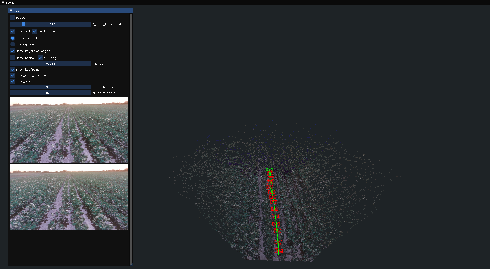

# MASt3R-SLAM for Rosario v2 dataset



## Setup

```
git submodule update --init --recursive
```

Get 2023-12-26-15-48-38.compressed.bag from https://cifasis.github.io/rosariov2/.

```
python3 -m venv .venv
source .venv/bin/activate
python3 -m pip install -r requirements.txt
```

```
rosbags-convert --src ./bags/zavalla2023/rosbags/2023-12-26-15-48-38.compressed.bag --src-typestore ros1_noetic --dst ./bags/2023-12-26-15-48-38 --dst-typestore ros2_jazzy

python3 ./src/extract_dataset.py --bag ./bags/2023-12-26-15-48-38 --output ./dataset/2023-12-26-15-48-38
```

```
# Pytorch (see https://pytorch.org/)
# CPU
export TORCH_INDEX=https://download.pytorch.org/whl/cpu

# ROCm
export TORCH_INDEX=https://download.pytorch.org/whl/rocm6.3

# CUDA 11.8
export TORCH_INDEX=https://download.pytorch.org/whl/cu118
# CUDA 12.1
export TORCH_INDEX=https://download.pytorch.org/whl/cu126
# CUDA 12.4
export TORCH_INDEX=https://download.pytorch.org/whl/cu128

python3 -m pip install --upgrade pip
python3 -m pip install torch torchvision torchaudio --index-url ${TORCH_INDEX}
```
```
python3 -m pip install MASt3R-SLAM/  --extra-index-url ${TORCH_INDEX}


# Optionally install torchcodec for faster mp4 loading
pip install torchcodec==0.1
```

## Run

```
source .venv/bin/activate
cd ./MASt3R-SLAM/
python ./main.py --dataset '../dataset/rosario/2023-12-26-15-48-38'  --config ../config/rosariov2.yaml --kf-buffer 128
```

If you get an error regarding `torch.AcceleratorError: HIP error: invalid device function` use:

```bash
export HSA_OVERRIDE_GFX_VERSION=10.3.0
export HSA_ENABLE_IPC_MODE_LEGACY=0
```

If you run out of VRAM try to reduce the `kf_buffer`.


## Reference 

- MASt3R-SLAM: Real-Time Dense SLAM with 3D Reconstruction Priors https://edexheim.github.io/mast3r-slam/
